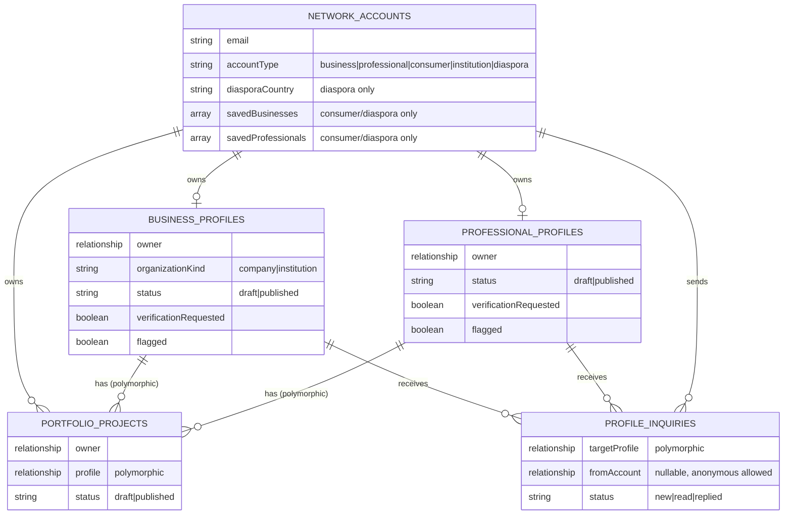

# Phase 9 — Identity & Discovery Planning Package

Source of truth: `Master Plan/THE_BUSINESS_Network_Blueprint_v3.docx` (Blueprint v3, August 2026), read in full for this package. Aligned to Blueprint sections 5, 6, 7, 8, 14, 38, 47, 49, 51, 52, 53 — which together describe exactly Blueprint §53's **Release 1 — Identity and Discovery**: "Registration, profiles, portfolios, directory, search, dashboard, contact requests." Sections 9–13 (Business/Professional Passports, Trust System, Trust Passport, Proof of Work, Reviews) are Blueprint's **Release 2 — Trust** and are deliberately excluded from this package — the user's own section list omits them, and this document treats that as confirmation, not oversight.

**Planning only.** No branch created, no code written, no Payload collections created, no PR opened. Every technical recommendation below is grounded in the current, verified state of `THE-BUSINESS-LB`'s codebase (Next.js 15 App Router + Payload CMS 3.x, single Postgres/Supabase instance, deployed on Vercel) — not invented independently of it. Where the Blueprint's language is ambiguous or aspirational, this package states the interpretation chosen and why, the same way every prior phase's planning has resolved ambiguity by making an explicit, reasoned call rather than leaving it open.

---

## 1. Executive Summary

THE BUSINESS Network, as described in Blueprint v3, is a multi-sided marketplace and identity platform — businesses, professionals, consumers, institutions and diaspora members, each with accounts, profiles, directories, search, and dashboards. This is not an incremental feature on the existing marketing website; it is a new application surface built on top of it, sharing the same Next.js app, the same Payload instance, and the same Postgres database, but introducing a second, entirely separate authentication system, five new user-facing account types, and two new large data models (Business Profiles, Professional Profiles) with their own public pages, search, and dashboards.

The existing site (Phases 1–8: marketing pages, Page Builder landing pages, lead capture, analytics) is untouched by this plan and continues operating exactly as it does today. Phase 9 adds alongside it, under new route groups and new Payload collections, with one deliberate, load-bearing architectural decision carried from Blueprint §51 itself: **the Network's public dashboard and login are separate from Payload's admin login** — a second `auth: true` Payload collection (`network-accounts`), not a repurposing of the existing `users` (admin/editor) collection.

This package's recommendation: **build Phase 9 as four separate, sequential implementation phases (9A–9D)**, each with its own Plan → Implement → Validate → Release Review → Deploy cycle, matching this project's proven per-phase discipline rather than one large PR. Total estimated effort is **8–10 weeks (roughly 40–50 working days)** — an order of magnitude larger than any prior phase, because this is genuinely a new product surface, not a feature addition. See §22 and §D for the full breakdown and reasoning.

The single most important non-engineering risk this package surfaces (§D of the Risk Assessment): operating a public multi-sided directory is an ongoing product and moderation commitment, not a one-time build — see §20 and the Go/No-Go section for how Phase 9 is scoped to keep that commitment minimal at launch without silently under-building the trust/safety groundwork it will need later.

---

## 2. Phase 9 Objectives

Directly from Blueprint §3 (Strategic Objectives) and §53 (Release 1), narrowed to what Release 1 alone can deliver:

1. Give businesses and professionals a real digital identity on the Network — an account, a structured profile, and a public page — separate from THE BUSINESS lb's own agency marketing site.
2. Let consumers discover businesses and professionals through a real directory and structured search, without requiring an account to browse.
3. Let a consumer or registered user contact a business or professional directly through the profile — the "contact forms and quote requests" line from Blueprint §52, extended to Network profiles.
4. Establish the "one profile, multiple outputs" data model (Blueprint §6) structurally — one Business Profile and one Professional Profile shape rich enough that Passport, CV, personal website and other future outputs (Release 2+) can be generated from it later — while shipping only the single output Release 1 actually needs: **the public Network profile page**.
5. Ship a functioning, if intentionally minimal, member dashboard so registered users have a reason to return: edit their profile, manage their portfolio, and see who has contacted them.
6. Do all of this without touching, breaking, or slowing down the existing marketing site, its lead-capture pipeline (Phase 7), or its analytics (Phase 8).

Explicitly **not** an objective of Phase 9: verification badges, trust scores, reviews, paid subscriptions, CRM, booking, AI tools, opportunity matching, or any Release 2–5 feature. Building toward those later should not require re-architecting what Phase 9 ships — that is the test this package's data model is designed against.

---

## 3. Scope Boundaries

### 3.1 Included

- Two new public-facing account types with full registration/login/session: **Business** and **Professional**.
- Three additional account-type *labels* at registration — **Consumer**, **Institution**, **Diaspora** — with real accounts and dashboards, but deliberately lighter data models (§4, §9–§13 explain why and how).
- Business Profile and Professional Profile data models (Blueprint §7, §8), editable only by their owner.
- Portfolio (Blueprint §8's "Portfolio" subsection) as its own collection, attached to either profile type.
- Public profile pages for Business and Professional profiles (Blueprint §6's "Public Network Profile" output — the *only* output Phase 9 ships from the one-profile-multiple-outputs model).
- Business Directory and Professional Directory (Blueprint §47's `/network/businesses`, `/network/professionals`) with structured filter search (Blueprint §14, scoped — see §3.2).
- A minimal Member Dashboard (Blueprint §38, scoped — see §3.2): profile editor, portfolio manager, inbound-inquiry inbox, account settings.
- Registration and onboarding flows for all five account types (Blueprint §49).
- A lightweight "verification requested" intake field (not a badge, not a review workflow — see §20).
- Moderation groundwork: report/flag capability and admin takedown, using Payload's existing admin panel (no new admin UI beyond what Payload's collection list view already provides — the same pattern proven for Leads in Phase 7).

### 3.2 Excluded

Excluded explicitly, each mapped to the Blueprint release that actually owns it:

| Excluded from Phase 9 | Blueprint reference | Owning release |
|---|---|---|
| Verification badges, Trust Passport, Proof-of-Work labels, review/recommendation system | §9–§13 | Release 2 — Trust |
| Business/Professional Passport (URL/QR/PDF/NFC output) | §9 | Release 2 |
| CV PDF generator, personal-website generator, custom domains | §6, §52 ("Build Interface, Label Coming Soon") | Release 2+ |
| SaaS paid tiers, CRM Lite, proposals/quotations, booking system, loyalty tools | §38–§43 | Release 3 |
| AI Growth Partner tools | §24 | Release 3 |
| Offer/Need exchange, Opportunity Radar, Concierge, Collaboration Builder, jobs/opportunities marketplace | §16–§20 | Release 4 |
| Digital Neighborhoods, Diaspora Bridge (the full feature, not the account-type label), Market Pulse, institutional portals, white-label networks, Market Missions | §29–§37 | Release 5 |
| Natural-language / AI-powered search | §14 (partially — see below) | Deferred, likely alongside Release 3's AI tools |
| A redesigned marketing homepage in the Blueprint §48 style | §48 | Explicitly out — a separate, higher-visibility business decision, not bundled here (§21) |
| Product catalogue / product discovery as a distinct entity | §7's "Products" subsection | Deferred — Business Profiles carry a lightweight services list only in Phase 9; a full Products collection with its own discovery surface is real, separate scope |

**On search (§14):** Blueprint §14 lists example queries like *"Restaurants offering delivery in Akkar"* framed as natural-language search. Building genuine NLP/semantic search requires an embeddings/AI layer this project has no infrastructure for yet (Phase 8 confirmed no AI tooling exists in the codebase). Phase 9 ships **structured filter + keyword search** (industry, category, location, service, language, availability, plus Postgres full-text search across name/description/services) that answers the *same underlying questions* through a well-designed filter UI rather than free-text NLP. This is stated as a deliberate, honest scoping decision, not a silent downgrade — true natural-language search is a good Release 3 candidate once an AI layer exists for other reasons (§24's AI Growth Partner).

---

## 4. User Types

| Type | Blueprint § | Phase 9 treatment |
|---|---|---|
| **Business** | §4.1, §7 | Full profile (`business-profiles`), full onboarding, full dashboard, directory listing. |
| **Professional** | §4.2, §8 | Full profile (`professional-profiles`), full onboarding, full dashboard, directory listing. |
| **Consumer** | §4.3 | Account only (`network-accounts`, `accountType: consumer`) — no profile collection. Dashboard limited to saved businesses/professionals and an inquiry history (§9's Consumer Dashboard, scoped). Can browse and contact without registering at all; an account only unlocks saving/following. |
| **Institution** | §4.5 | Account with `accountType: institution`, using the **Business Profile** shape (an institution is an organization, structurally) with an `organizationKind` field distinguishing `company` / `institution`. No member-directory, portal, or program features — those are Release 5 (§31–§37). This avoids building a fourth near-empty profile collection for a user type whose real feature set doesn't exist yet. |
| **Diaspora** | §4.6, §33 | Account with `accountType: diaspora`, functionally a Consumer account plus one extra field (`diasporaCountry`) captured at registration for future Diaspora Bridge targeting (§33, Release 5). No separate profile, no separate dashboard — this is intentionally the lightest-weight account type in Phase 9, since its real feature set is explicitly Release 5. |

**Why not five parallel profile collections:** the Blueprint's five account types don't imply five distinct *data shapes* — Business and Institution are both organizations; Consumer and Diaspora are both "browse and save" identities with no public profile of their own. Building two profile collections (Business, Professional) that cover all five account types via a discriminator field is simpler to build, simpler to query, and avoids Release 2–5 features arriving to find three empty, unused collections waiting for them.

---

## 5. Authentication Architecture

**Decision: a second Payload `auth: true` collection, `network-accounts`, completely separate from the existing `users` collection.**

This is directly required by Blueprint §51: *"The current Payload admin login is for authorized administrators. Public users should receive a separate, simpler Network dashboard."* Payload CMS 3.x supports multiple independent `auth: true` collections in one instance — each gets its own login/logout/refresh/forgot-password/reset-password/verify-email REST endpoints (e.g. `/api/network-accounts/login` alongside the existing `/api/users/login` that already powers the admin panel), its own session cookie, and its own JWT. `req.user.collection` on the server distinguishes which auth collection authenticated a given request, which is how every access-control function below tells an admin/editor apart from a network account.

Why not a wholly separate custom application (a literal second deployment), even though Blueprint §51's phrasing — *"Custom application built specifically for Network users"* — could be read that way: this project's entire stack (Next.js + Payload + Postgres, one Vercel deployment) already supports exactly this "two audiences, one instance" split natively, and standing up a second deployment would duplicate database access, environment configuration, deployment pipeline and auth code for no benefit this stack doesn't already provide. This package interprets §51 pragmatically: "custom application" = new Next.js route groups and new Payload collections purpose-built for Network users, not a literal second codebase.

**What this buys, concretely, at zero extra dependency cost:**
- Password hashing, session cookies, JWT issuance/refresh, account lockout after failed attempts, email verification, and forgot/reset-password flows all come from Payload's already-proven, already-deployed auth implementation (the same code path powering admin login today) — no new auth library, no custom crypto.
- `network-accounts` is configured with `access.admin: () => false` (or excluded from `admin.user`), so a network account can never authenticate into Payload's `/admin` panel, structurally — not just by convention.
- Registration reuses the exact honeypot + time-on-form + `RateLimitEvents`-backed throttle pattern already proven in Phase 7's forms, applied to the new `/register` and `/login` routes.

**Session boundary:** admin sessions (`users`) and network sessions (`network-accounts`) are fully independent cookies/JWTs. Being logged into one implies nothing about the other — an admin/editor who wants to *also* have a Network account (e.g., to test the member experience) needs a second, separate registration exactly like any other user.

---

## 6. Authorization / Roles Model

Two, deliberately different, authorization models coexist:

**Admin side (unchanged):** the existing `adminOrEditor`/`adminOnly` role model (`payload/access.ts`) continues to govern the `users` collection and all existing content collections. Admins/editors get full read/write access to every new Network collection too, via the Payload admin panel — this is how moderation and takedown work in Phase 9 (§20), with no new admin UI required.

**Network side (new): ownership-based, not role-based.** A `network-accounts` user has no "role" in the admin sense — authorization is simply *"can this account read/write this specific document because it owns it."* Every owned collection (`business-profiles`, `professional-profiles`, `portfolio-projects`) carries an `owner` relationship field to `network-accounts`, and access control is:

```
read:   published documents → anyone (public directory/profile pages)
        unpublished/draft documents → owner only, or admin/editor
create: any authenticated network-accounts user (of the matching accountType)
update: owner only, or admin/editor
delete: owner only, or admin/editor
```

`profile-inquiries` (§16) access is narrower: only the `targetProfile`'s owner can read the inquiries addressed to them — one network account must never be able to read another's inbox, mirroring the ownership isolation already proven for `Leads` in Phase 7 (staff-only there; owner-only here).

No intermediate roles (e.g., "team member with edit access to a business profile") are in Phase 9 scope — Blueprint §38 mentions "Team Access" as a Business dashboard section, but multi-user ownership of one profile is real, separate scope deferred alongside Release 3's other SaaS-tier features.

---

## 7. Registration Flow

Single entry point (`/register`) presenting Blueprint §49's five account-type cards (*Build My Professional Identity / Build My Business Presence / Find Businesses and Professionals / Represent an Institution / Connect Through the Diaspora*) before anything else — the account type is chosen first, not inferred later, since it determines which onboarding wizard follows.

```
/register
  → choose account type (professional | business | consumer | institution | diaspora)
  → email + password (Payload's native network-accounts.create, honeypot + throttle)
  → Payload sends verification email (built-in auth.verify — no custom email code)
  → user clicks verification link → account active
  → redirect into type-specific onboarding (§8), OR straight to /network for consumer/diaspora
```

Consumer and Diaspora accounts skip onboarding entirely after email verification — there's no profile to build, per §4's data-shape decision. They land directly in a minimal dashboard (§15).

**Registration ≠ browsing gate.** The directory and public profile pages (§13) are fully browsable without an account, matching Blueprint §15's premise that consumers need a *reason* to register (saving, following, contacting) rather than a *requirement* to register. This is a deliberate product decision worth stating plainly: an account-walled directory would suppress the exact discovery behavior (§14) the whole Network exists to enable.

---

## 8. Onboarding Flows

**Business onboarding** (Blueprint §49, followed exactly, as a multi-step wizard against `business-profiles`, each step a partial update so a user can abandon and resume):

1. Business identity (name, slug, logo, cover, short description)
2. Full description, industry, categories/subcategories
3. Contact information (phone, WhatsApp, email, address, map, hours)
4. Services (structured list — no product catalogue in Phase 9, §3.2)
5. Portfolio (optional at onboarding; can be added later from the dashboard)
6. Team (optional, simple name/role list — no per-member accounts, §6)
7. Preview (renders the actual public profile template against draft data — the same draft-preview pattern already proven on Pages/CaseStudies)
8. Publish (sets `_status: published`) — verification-request is an optional checkbox at this step, not a gate (§20)

**Professional onboarding**, same structural pattern, against `professional-profiles`:

1. Personal information (photo, name, title, location, languages, short bio)
2. Full biography, career information (experience, education, skills)
3. Professional services (services offered, availability, service locations)
4. Portfolio
5. Preview
6. Publish

**Institution onboarding** reuses the Business wizard verbatim (§4's shared data shape), with copy/labels adjusted ("organization name" instead of "business name," etc.) — no separate wizard code, just conditional labels driven by `accountType`.

Both wizards are built as a single multi-step client form against one Payload document (draft-saved between steps), not five separate form submissions — this matches the "one profile" principle from Blueprint §6 structurally from the very first step, rather than assembling the profile from disconnected pieces.

---

## 9. Business Profile Data Model

Collection: `business-profiles`. Fields grouped exactly per Blueprint §7's four subsections, plus the ownership/status/discovery fields every profile needs:

| Group | Fields |
|---|---|
| **Ownership & status** | `owner` (relationship → network-accounts, required), `_status` (draft/published, via Payload versions), `accountType` snapshot (`business` \| `institution`), `verificationRequested` (boolean), `flagged` (boolean, admin-set), `slug` (unique, reserved-slug-checked — §18) |
| **Business Identity** (§7) | `name`, `slug`, `logo`, `coverImage`, `shortDescription`, `fullDescription`, `industry` (select), `categories` (multi-select), `yearEstablished`, `businessSize` (select), `headquarters` (location), `branches` (array of locations), `serviceLocations` (array), `languages` (multi-select), `organizationKind` (`company` \| `institution`) |
| **Business Story** (§7) | `about`, `mission`, `vision`, `founderStory`, `companyHistory`, `values`, `competitiveAdvantage`, `milestones` (array) |
| **Commercial Information** (§7) | `services` (array: name, description, priceIndicator), `team` (array: name, role, photo) — `products`, `caseStudies`/`certifications`/`awards`/`partners` fields reserved in the schema but not required or surfaced in UI yet, keeping the shape forward-compatible without building the features |
| **Consumer Information** (§7) | `openingHours`, `phone`, `email`, `whatsapp`, `address`, `mapCoordinates`, `deliveryAreas`, `bookingLink` (URL, external — no booking system yet), `faqs` (array), `paymentOptions` (multi-select) |
| **Business Objectives** (§7) | `seeking` (multi-select: customers/suppliers/distributors/employees/freelancers/partners/mentors), `exportReady` (boolean), `wholesaleAvailable` (boolean), `openToInternationalBuyers` (boolean), `openToInstitutionalCollaboration` (boolean) — captured now, since it's cheap structured data, even though the matching features (Diaspora Bridge, Opportunity Radar) that *use* it are Release 4–5 |

`portfolio` is **not** an embedded field here — it's a separate collection (§11) related back to this one, for the reasons given there.

---

## 10. Professional Profile Data Model

Collection: `professional-profiles`, structured per Blueprint §8:

| Group | Fields |
|---|---|
| **Ownership & status** | Same shape as Business Profiles: `owner`, `_status`, `verificationRequested`, `flagged`, `slug` |
| **Personal Information** (§8) | `photo`, `name`, `professionalTitle`, `location`, `languages`, `shortBio`, `fullBio`, `contactEmail`, `contactPhone`, `availability` (select: available now / by appointment / unavailable), `workPreferences` (multi-select: remote / on-site / hybrid) |
| **Career Information** (§8) | `experience` (array: title, company, period, description), `education` (array), `skills` (multi-select/tags), `certifications` (array), `licenses` (array), `awards` (array), `publications` (array), `volunteerWork` (array), `professionalOrganizations` (array) |
| **Professional Services** (§8) | `servicesOffered` (array), `expertiseAreas` (multi-select), `industriesServed` (multi-select), `remoteOrOnSite`, `serviceLocations`, `startingPrice` (indicator, not a real payment field), `bookingLink` (external URL only) |

Same pattern as Business Profiles: `portfolio` lives in the separate `portfolio-projects` collection.

---

## 11. Portfolio Architecture

**Decision: a separate collection, `portfolio-projects`, not an array field embedded in each profile.**

Reasoning, grounded in this codebase's own precedent: `CaseStudies` already exists as a standalone collection with exactly this shape (title, description, images, client, results) and is proven at scale for the marketing site. A portfolio project deserves the same treatment for the same reasons — independent moderation (an admin can unpublish one bad portfolio item without touching the whole profile), independent access control, and room for a future "client confirms this project" flow (Blueprint §12's Proof of Work) to attach to a *specific* project without redesigning the profile schema when Phase 10 (Trust) arrives.

| Field | Notes |
|---|---|
| `owner` | relationship → network-accounts |
| `profile` | polymorphic relationship → business-profiles OR professional-profiles (Payload supports relationship fields with multiple allowed collections) |
| `title`, `description` | |
| `images`, `videos`, `documents` | media uploads, reusing the existing `Media` collection + Vercel Blob storage already proven since Phase 1 |
| `skillsApplied` | multi-select, professional profiles only in practice |
| `client` | plain text — "client confirmation" as a verified flow is Release 2, not built here; the field exists so Phase 10 can add the confirmation workflow without a schema change |
| `results` | plain text |
| `projectLink` | optional external URL |
| `completionDate` | |
| `_status` | draft/published, same pattern as profiles |

---

## 12. Public Profile Architecture

The one output Phase 9 ships from Blueprint §6's "one profile, multiple outputs" model. Server-rendered pages (matching this codebase's existing pattern for `Pages`/`CaseStudies`/`Services` — `generateStaticParams` + `dynamicParams: true` so a newly published profile goes live on next request without a rebuild, exactly like Phase 5B's precedent for Pages):

- `/network/businesses/[slug]` — renders published `business-profiles` docs
- `/network/professionals/[slug]` — renders published `professional-profiles` docs

Each page composes: identity header (logo/photo, name, tagline, location, languages), story section, services list, portfolio grid (querying `portfolio-projects` where `profile` = this doc and `_status: published`), consumer-info block (contact/hours/map — reusing the `WhatsAppLink` component's tracked-click pattern from Phase 8 for the "Message on WhatsApp" CTA), and a **Contact this business/professional** form that writes to `profile-inquiries` (§16). No verification badges, no trust signals, no reviews render here — none of that data exists yet in Phase 9's model (§3.2).

Unpublished (`_status: draft`) profiles 404 for everyone except the owner and admin/editor — same access pattern already proven for draft Pages/CaseStudies via `isPreviewMode()`.

---

## 13. Directory Architecture

- `/network/businesses` — Business Directory, paginated list of published `business-profiles`, filterable (§14)
- `/network/professionals` — Professional Directory, paginated list of published `professional-profiles`
- `/network` — a thin hub page linking into both, plus (from Blueprint §32's "Made in Lebanon" and other tag-based curations that don't depend on verification) a small, hardcoded set of curated collection links (e.g. "New Businesses" = published in last 30 days, "Youth-Led" / "Family Business" = a `tags` multi-select field on the profile) — not a full CMS-driven "Collections" builder, which is real, separate scope for a later phase once curated collections prove valuable

Directory pagination reuses the existing `lib/cms/pagination.ts` helper already proven across Services/Articles/CaseStudies rather than inventing a second pagination convention.

---

## 14. Search & Filter Architecture

Per §3.2's scoping decision: structured filters, not NLP. Filters, directly from Blueprint §14's list, narrowed to what Phase 9's data model actually has:

`industry`, `category`, `service`, `location` (region/city), `language`, `availability` (professionals), `remoteOrOnSite` (professionals), `businessSize`, `exportReady`. (`verified status`, `rating`, `response time`, `years active` all depend on Trust/Release 2 data that doesn't exist yet — filters for them are visibly absent, not present-but-broken.)

**Technical approach:** Postgres full-text search (`tsvector` generated column + GIN index on `name`/`shortDescription`/`services`) for the keyword box, combined with standard `where` filtering on the structured fields above via Payload's query API — no external search service (Algolia/Elasticsearch) needed at Phase 9's scale, consistent with this project's established preference against premature infrastructure. If search relevance or volume later demands it, swapping in a dedicated search service is a contained change behind the same filter API, not a rearchitecture.

---

## 15. Dashboard Architecture

Scoped to what's genuinely Release-1-appropriate — the rest of Blueprint §38's business/professional dashboard sections (Leads pipeline beyond a simple inbox, CRM, Bookings, Analytics, AI Tools, Billing, Team Access) are Release 3, not built here:

| Route | Business | Professional | Consumer |
|---|---|---|---|
| `/dashboard` (Overview) | ✅ profile completeness, recent inquiries | ✅ | ✅ saved items summary |
| `/dashboard/profile` | ✅ edit business-profiles | ✅ edit professional-profiles | — (no profile) |
| `/dashboard/portfolio` | ✅ manage portfolio-projects | ✅ | — |
| `/dashboard/inbox` | ✅ profile-inquiries addressed to them | ✅ | — |
| `/dashboard/saved` | — | — | ✅ saved businesses/professionals |
| `/dashboard/settings` | ✅ account email/password, via Payload's native flows | ✅ | ✅ |

Institution accounts get the Business dashboard (same underlying profile type, §4). Diaspora accounts get the Consumer dashboard plus the `diasporaCountry` field on settings.

**Auth gating:** `middleware.ts` currently applies only security headers, with no route-based auth check (verified directly in the current codebase). Phase 9A must extend it (or add a `layout.tsx`-level server check under a new `app/(dashboard)/` route group) to redirect unauthenticated requests to `/login`, reading the `network-accounts` session cookie — this is genuinely new middleware logic, not a reuse of anything existing.

---

## 16. Payload Collection Architecture

New collections, all registered in `payload.config.ts` alongside the existing 12:

| Collection (slug) | Purpose | Auth? |
|---|---|---|
| `network-accounts` | Public login identity for all 5 account types | ✅ `auth: true` |
| `business-profiles` | Business + Institution profiles | — |
| `professional-profiles` | Professional profiles | — |
| `portfolio-projects` | Portfolio items, owned by either profile type | — |
| `profile-inquiries` | Inbound contact-form submissions addressed to a specific profile | — |

**Why `profile-inquiries` is a new collection, not a reuse of Phase 7's `Leads`:** `Leads` models inquiries *for THE BUSINESS lb's own agency services* (assessment/contact/quote), staff-only access, no per-record ownership concept. `profile-inquiries` models inquiries *for a Network member's business or professional profile*, and must be readable by that member and *only* that member — a structurally different access-control shape (ownership-scoped, not staff-scoped) that would corrupt `Leads`' existing, already-validated staff-only guarantee if bolted on. Keeping them separate also means Phase 9 introduces zero risk to Phase 7's lead-capture pipeline — a hard requirement carried through every phase of this project.

Access control for each new collection follows §6's ownership model, expressed the same way `payload/access.ts` already expresses the admin role model — a new `payload/access-network.ts` (or extending the existing file) with `ownerOrStaff`, `publishedOrOwnerOrStaff`, etc. helpers, mirroring `adminOrEditor`'s existing shape rather than inventing a new pattern.

**Reserved-slugs impact (concrete, verified):** every new top-level static route this phase introduces — `/network`, `/register`, `/login`, `/dashboard` — must be added to `lib/cms/reserved-slugs.ts`'s `RESERVED_SLUGS` set before launch. This is not optional housekeeping: Phase 2 already reproduced a real production bug (`PHASE2-COLLISION-FIX-REPORT.md`) where a published Page with a colliding slug silently hijacked a literal route via the `[slug]` catch-all, with the reserved-slugs check as the *only* structural backstop. Phase 9A's first implementation step should update this list before any new route ships.

---

## 17. Database Relationship Diagram



`NETWORK_ACCOUNTS ||--o| BUSINESS_PROFILES` (zero-or-one) reflects Phase 9's deliberate one-account-one-profile limit (§9) — multi-business-per-account is real, separate scope.

---

## 18. URL Structure

Directly from Blueprint §47's table, adopted as-is where it names concrete paths, extended only where the Blueprint left a gap (login/register weren't given a section):

| Section | Routes |
|---|---|
| Network (new route group `app/(network)/`) | `/network`, `/network/businesses`, `/network/businesses/[slug]`, `/network/professionals`, `/network/professionals/[slug]` |
| Auth (new, within `(network)` or a dedicated `(auth)` group) | `/register`, `/login`, `/verify-email`, `/forgot-password`, `/reset-password` |
| Dashboard (new route group `app/(dashboard)/`, auth-gated) | `/dashboard`, `/dashboard/profile`, `/dashboard/portfolio`, `/dashboard/inbox`, `/dashboard/saved`, `/dashboard/settings` |

Existing groups (`(app)` marketing site, `(payload)` admin) are untouched. All new top-level segments (`network`, `register`, `login`, `dashboard`) go into `RESERVED_SLUGS` (§16).

---

## 19. API Architecture

No new REST framework — Payload auto-generates full REST + GraphQL CRUD for every collection the moment it's registered, exactly as it already does for `Leads`/`NewsletterSubscribers` today. Concretely:

- `network-accounts` gets `/api/network-accounts/login`, `/logout`, `/refresh-token`, `/me`, `/forgot-password`, `/reset-password`, `/verify/:token` for free from `auth: true` — no hand-written auth endpoints.
- `business-profiles`, `professional-profiles`, `portfolio-projects`, `profile-inquiries` get standard `/api/{collection}` CRUD, gated entirely by the access-control functions in §6/§16 — the API itself needs no bespoke authorization code beyond those functions, the same way every existing collection works today.
- Server Components (directory pages, profile pages) read via Payload's **Local API** (`payload.find()`/`payload.findByID()`), wrapped in `lib/cms/*.ts`-style modules with React's `cache()` — the exact convention already used for every existing content type, extended to `lib/network/*.ts` for the new collections, not reinvented.
- Dashboard client components (profile editor, portfolio manager) call Payload's REST API directly with the network-accounts session cookie, the standard Payload-admin-UI pattern applied to a custom UI instead of Payload's own admin panel.
- Contact-form submission (`profile-inquiries`) reuses the Server Action + honeypot + `RateLimitEvents`-throttle pattern from `lib/actions.ts`, proven since Phase 7, applied to a new `submitProfileInquiryAction`.

---

## 20. Moderation & Verification Preparation

Phase 9 deliberately does **not** build Blueprint §9–§13's Trust System (badges, confirmed projects, reviews) — that's Release 2. What it *does* build, so Release 2 isn't starting from zero:

- `verificationRequested: boolean` on both profile collections — captured at publish time (§8), stored, never surfaced as a badge. This satisfies Blueprint §52's "Verification application" line item narrowly and honestly: it's an intake checkbox, not a verification system.
- `flagged: boolean` + a `flagReason` text field, settable only by admin/editor, with a public "Report this profile" link on every public profile page that creates a simple flag (not a full report/appeal workflow — that's Release 2's Resolution Center, §13).
- No pre-publish review queue: profiles publish immediately on the owner's action, matching how most real-world directory products actually work (LinkedIn, Yelp) and matching Blueprint's own onboarding flow, where "Submit for verification" and "Publish" are sequential, not gated on each other.
- Abuse mitigation for the *absence* of pre-publish review: the same honeypot + time-on-form + persistent-throttle stack proven in Phase 7, applied to registration and profile creation, plus admin's existing unrestricted edit/unpublish/delete access via the Payload panel — the same takedown mechanism already relied on for every other collection.

This is the direct answer to the operational-commitment risk raised in §1 and the Go/No-Go section: Phase 9 ships a public directory that can be moderated reactively (report → admin review → takedown) from day one, without pretending to have built proactive trust/verification infrastructure it hasn't.

---

## 21. Migration Strategy From Current Website

There is no data migration in Phase 7's sense (nothing existing needs to move *into* these new collections — Network profiles are new). "Migration" here means integration without disruption:

1. **Reserved slugs** (§16, §18) — must be updated before any new route ships, or a Payload Page could silently hijack `/network`, `/login`, `/register`, or `/dashboard` exactly as documented in `PHASE2-COLLISION-FIX-REPORT.md`.
2. **Existing Digital Business Assessment** (already built, pre-dates this session's visible phases) needs no change — Blueprint §21/§52 treat it as already part of the Network's "Growth" pillar; Phase 9 links to it from the new dashboard/profile surfaces rather than rebuilding it.
3. **Homepage** — Blueprint §48 describes a fundamentally different, Network-search-first homepage. **This package explicitly excludes redesigning the existing marketing homepage from Phase 9.** Replacing the primary page real visitors and referral traffic land on is a distinct, highly visible business decision that deserves its own explicit sign-off, not something that should ride along inside a backend/data-model phase. Phase 9's homepage touch is limited to adding new navigation entries (e.g. a "Network" header link) and, at most, one small homepage teaser section pointing into `/network` — a small, additive, easily-reverted change, not a redesign.
4. **Analytics (Phase 8)** — the `track()`/`WhatsAppLink`/consent infrastructure is reused as-is for new Network CTAs (e.g. a `profile_contact_click` event on the "Contact this business" button, `directory_search` on filter submission) rather than building parallel tracking. New event types get added to `lib/analytics/track.ts`'s `EventPayloads`, following the exact pattern Phase 8 established.
5. **No changes to `Leads`, `NewsletterSubscribers`, `RateLimitEvents`, or any existing collection's schema or access control.** Phase 9 is additive at the database level — new tables in the same `cms` Postgres schema, same pattern Phase 7 used when it added `Leads` alongside the untouched legacy Drizzle tables.

---

## 22. Release Breakdown

Phase 9 is split into four sequential sub-phases, each shipped as its own PR through the full Plan → Implement → Validate → Release Review → Deploy cycle — not one large PR. Reasoning in §D.

### Phase 9A — Authentication & Account Types

**Deliverables**
- `network-accounts` collection (`auth: true`), registered in `payload.config.ts`
- `/register` (5 account-type selection + email/password), `/login`, `/verify-email`, `/forgot-password`, `/reset-password` pages
- Session-aware middleware/layout gating for a new `(dashboard)` route group (redirects unauthenticated requests to `/login`)
- `RESERVED_SLUGS` updated for `network`, `register`, `login`, `dashboard`
- Registration abuse protection (honeypot + throttle, reusing Phase 7's pattern)
- `payload/access-network.ts` ownership-access helpers (used by every later sub-phase)

**Dependencies:** none beyond the existing stack — this is the foundation every other sub-phase builds on.

**Risks**
- Multi-collection Payload auth (`network-accounts` alongside `users`) is new territory for this codebase — the `req.user.collection` discrimination and cookie-namespace separation should be verified directly against a real login flow early, not assumed correct from documentation alone (this project's standing "verify, don't trust" discipline).
- Middleware auth-gating risks accidentally over-broadening the existing CSP/security-header middleware's matcher — must be validated to not affect `(app)`/`(payload)` routes.

**Acceptance criteria**
- All 5 account types can register, verify email, log in, log out, and reset a forgotten password, end-to-end, in a real browser.
- An admin/editor session and a network-accounts session are confirmed independent (logging into one doesn't authenticate the other; clearing one doesn't clear the other).
- `/dashboard/*` correctly redirects an unauthenticated visitor to `/login` and correctly admits an authenticated one.
- Zero regression in existing `(app)`/`(payload)` routes, security headers, or Phase 7/8 functionality (full regression re-check, matching the standard established every prior phase).

### Phase 9B — Business & Professional Profiles

**Deliverables**
- `business-profiles`, `professional-profiles`, `portfolio-projects` collections with full field sets (§9–§11)
- Multi-step onboarding wizards for Business, Professional, Institution (§8)
- Draft/preview/publish flow, reusing the versions pattern proven on Pages/CaseStudies
- Public profile pages: `/network/businesses/[slug]`, `/network/professionals/[slug]` (§12)
- Profile editor + portfolio manager inside `/dashboard`

**Dependencies:** Phase 9A (accounts must exist before profiles can be owned).

**Risks**
- Polymorphic `profile` relationship on `portfolio-projects` (pointing at either collection) needs early technical validation — Payload supports multi-collection relationship fields, but this codebase has no existing precedent for one, so first use should be verified directly, not assumed.
- Onboarding wizard step-by-step draft-saving needs care to avoid the exact class of race condition Phase 8 found in `track()` (state assumed ready before it actually is) — each step's save should be confirmed durable before advancing.

**Acceptance criteria**
- A real Business and a real Professional account can complete onboarding end-to-end and see a correctly rendered public profile at their slug.
- Draft (unpublished) profiles are confirmed inaccessible to anyone but the owner and admin/editor.
- Portfolio items correctly attach to and render under the right profile type.
- Reserved-slug collision check passes for every profile slug (no business/professional can register a slug that collides with an existing route).

### Phase 9C — Directories & Search

**Deliverables**
- `/network`, `/network/businesses`, `/network/professionals` directory pages with pagination (reusing `lib/cms/pagination.ts`)
- Structured filter search (§14) with Postgres full-text keyword search
- Curated, tag-based collection links (New Businesses, Youth-Led, etc.)

**Dependencies:** Phase 9B (there must be published profiles to list and search).

**Risks**
- Full-text search performance at scale is unverified for this codebase (no precedent) — should be load-tested with a realistic seeded volume before release, not assumed fine from a handful of manually created test profiles.
- Filter-combination UX complexity (multiple simultaneous filters) risks becoming confusing without real user testing — flagged for a lightweight usability pass, not full research.

**Acceptance criteria**
- Directory pages correctly list only published profiles, correctly paginate, and correctly apply every documented filter individually and in combination.
- Keyword search returns relevant results for the example query shapes named in Blueprint §14 (adapted to the structured-filter approach, e.g. "restaurants" + "Akkar" location filter rather than literal NLP).
- Directory and search pages load acceptably fast at a realistic seeded data volume (validated, not assumed).

### Phase 9D — Member Dashboard

**Deliverables**
- `/dashboard` overview, `/dashboard/inbox` (profile-inquiries), `/dashboard/saved` (consumer), `/dashboard/settings`
- `profile-inquiries` collection + "Contact this business/professional" form on public profile pages
- New Phase-8-pattern analytics events for Network interactions

**Dependencies:** Phase 9A (accounts), Phase 9B (profiles to contact), Phase 9C (directory as the primary path to a profile).

**Risks**
- Inquiry-ownership access control is the same class of bug Phase 8 found and fixed twice this session (a component silently not enforcing the intended scoping) — this collection's access functions need explicit, direct testing (one network account confirmed unable to read another's inbox), not just a code read.
- Consumer "saved" relationships (arrays on `network-accounts`) could grow unbounded for a very active user — acceptable at Phase 9 scale, worth a comment flagging it as a future pagination concern rather than solving prematurely.

**Acceptance criteria**
- A real inquiry submitted through a public profile page correctly appears only in that profile owner's inbox, confirmed by attempting (and failing) to read it as a different account.
- Consumer save/follow actions correctly persist and correctly display in `/dashboard/saved`.
- Full regression check across Phase 7/8 functionality, matching every prior phase's release-review discipline.

---

## A. Recommended Architecture

One Next.js app, one Payload instance, one Postgres database — extended, not replaced. Two new route groups (`(network)`, `(dashboard)`) alongside the existing `(app)`/`(payload)`. One new `auth: true` Payload collection (`network-accounts`) fully independent from the existing admin `users` collection, per Blueprint §51's explicit instruction. Two profile collections (`business-profiles`, `professional-profiles`) covering all five account types via discriminator fields rather than five parallel schemas. A separate `portfolio-projects` collection (precedented by the existing `CaseStudies` pattern) and a separate `profile-inquiries` collection (deliberately not a reuse of Phase 7's staff-only `Leads`). Ownership-based authorization for Network data, layered alongside the existing role-based authorization for admin data — two coexisting models, not a merged one, because they answer genuinely different questions ("do I own this" vs. "what's my staff role"). Structured filter search over Postgres full-text, not NLP/AI search, at Phase 9's scale. No new infrastructure, no new external services, no new deployment — every new capability is built from patterns this codebase has already proven across 8 phases.

## B. Risk Assessment

| Risk | Severity | Mitigation |
|---|---|---|
| Operating a public multi-sided directory is an ongoing moderation/support commitment, not a one-time build, for what has been a single-owner agency site through Phase 8 | **High, strategic** | Not an engineering risk to fix — a business-scale decision to make with eyes open. §20's reactive-moderation design keeps the day-one operational burden minimal; the Go/No-Go section (§E) recommends validating real demand before/alongside self-serve rollout. |
| Multi-collection Payload auth is unproven in this codebase | Medium | First real implementation step in 9A is a direct, verified login-flow test — not assumed correct from Payload's documentation, per this project's standing discipline. |
| Polymorphic relationships (`portfolio-projects.profile`, `profile-inquiries.targetProfile`) are unprecedented here | Medium | Verified directly and early in 9B, before building UI on top of an unconfirmed data-layer assumption. |
| Reserved-slug collisions on new top-level routes | Medium, well-understood | Concrete, already-documented mechanism (`PHASE2-COLLISION-FIX-REPORT.md`) exists and is directly reused — this is a known problem with a known fix, not a new unknown. |
| Directory/search performance at scale is unverified | Low at launch, grows over time | Load-tested in 9C's validation against realistic seeded volume before release, per §22. |
| Homepage redesign temptation creeping into scope | Medium, scope-discipline risk | Explicitly excluded in §21 with reasoning — flagged here so it stays a deliberate later decision, not an accidental scope-creep casualty of "while we're in there." |
| Four sequential sub-phases is a long calendar commitment before the full Release 1 vision is live | Low | Each sub-phase ships real, usable value on its own (accounts → profiles → discovery → engagement) rather than requiring all four before anything is useful — see §D. |

## C. Effort Estimate

Sized against Phase 7 (7.5–9.5 days) and Phase 8 (6.25–7.75 days) as the most recent comparables — both smaller-scope feature additions to an existing surface. Phase 9 is a new product surface (second auth system, two new large data models, new public-facing pages, a new dashboard), not a comparable size class, and this estimate says so honestly rather than compressing it to look more palatable.

| Sub-phase | Estimate | Why |
|---|---|---|
| 9A — Authentication & Account Types | 8–10 days | New auth collection, 5 registration paths, session-gating middleware, all genuinely new infrastructure, not a variation on existing patterns. |
| 9B — Business & Professional Profiles | 12–15 days | Two large data models, two multi-step onboarding wizards, draft/publish flow, public profile templates, portfolio collection with polymorphic relationships. The largest sub-phase — this is most of the actual "identity" deliverable. |
| 9C — Directories & Search | 7–9 days | Two directory pages, pagination reuse, structured filter search, full-text search index, curated collection links. |
| 9D — Member Dashboard | 7–9 days | Dashboard shell across 3 account-type variants, inquiry inbox with ownership-scoped access control, saved-items, contact-form wiring, new analytics events. |
| Fixed overhead ×4 (release review, PR, deploy, production validation per sub-phase) | ~4 days | ~1 day per sub-phase, matching every prior phase's fixed-overhead line item. |

**Total: roughly 38–47 working days (≈ 8–10 weeks)** across the four sub-phases, run sequentially. This does not include Release 2's Trust System or any later release — it is Release 1 alone.

## D. Build Order

**9A → 9B → 9C → 9D, strictly sequential, each its own full release cycle.** Not parallelized, and not bundled into one PR, for three concrete reasons:

1. **Hard dependency chain.** 9B needs accounts to own profiles; 9C needs profiles to list and search; 9D needs profiles and directories to have something to contact. There's no meaningful way to build them out of order.
2. **Each sub-phase ships real, independently useful value.** After 9A, the Network exists as an account system (useful for internal testing and early access, even with nothing to show publicly yet). After 9B, real businesses and professionals can have real public profiles — genuinely launchable on its own, even before search exists. After 9C, discovery works. After 9D, engagement closes the loop. This is a better rollout shape than one large, all-or-nothing PR that risks a multi-week release review of unreviewable size.
3. **Matches this project's proven discipline.** Every phase through Phase 8 has succeeded specifically because each PR was independently reviewable, independently validatable, and independently deployable, with real production validation between phases catching real bugs before the next phase built on top of them (Phase 8's own release review is the most recent, concrete proof this discipline works). There's no reason to abandon it for the largest, riskiest phase yet — if anything, it matters more here.

## E. Go / No-Go Recommendation

# ✅ GO — with one explicit condition

Every individual technical decision in this package is sound, grounded in the existing, already-proven stack, and scoped honestly against what Blueprint §52/§53 actually call for in Release 1 — no invented technology, no premature infrastructure, no silent overpromising (the search and verification scoping decisions in §3.2/§20 are the clearest examples of that discipline being applied here). The four-sub-phase build order is de-risked by this project's own track record across 8 phases of exactly this kind of incremental, validated delivery.

The condition is not technical: **before or alongside 9A's implementation, validate real demand with a small number of real businesses and professionals** (Blueprint's own Market Missions concept, §36, names "Digitalize 100 SMEs" as an example — even a much smaller pilot, 10–20 real accounts manually recruited, would do). This is not a blocker to starting 9A's engineering work, which is foundational regardless of pilot results — but committing to build a full public directory, moderation posture, and four-sub-phase, 8–10-week engineering investment on the strength of a strategy document alone, without confirming real businesses want to create these profiles, is the one place this package's confidence should not extend past what's actually been verified. This recommendation applies the same "verify, don't assume" standard to the business question that this package has applied throughout to every technical one.

**Recommend proceeding to Phase 9A implementation**, scoped exactly as this package describes, with the pilot-validation question raised explicitly for the user's decision rather than assumed answered.
