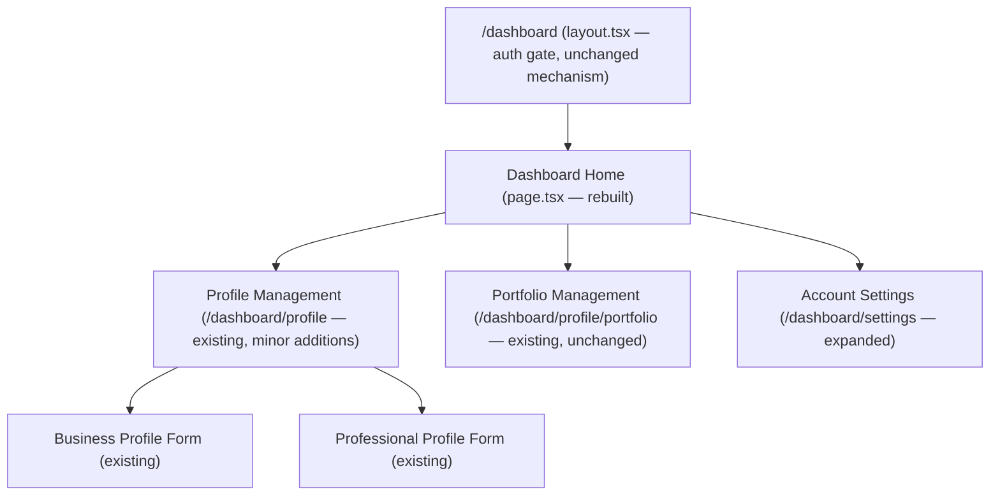

# Phase 9D — Member Dashboard Experience: Technical Design

**Design only. No code, no collections, no PR in this document's scope.**

Scope as explicitly authorized this turn: Dashboard Home, Business Dashboard, Professional Dashboard, Profile Management, Portfolio Management, Account Settings, Profile Completion Progress, Saved Profiles (evaluate), Dashboard Navigation, Permissions Model, Dashboard UX Structure, Data Architecture. Excluded: Reviews, Verification, Trust Badges, Recommendations, Opportunities, Jobs, AI Features, CRM Features, Marketplace, Booking, Payments, Subscriptions.

**Pre-implementation validation performed for this document**: re-read Blueprint v3 §38 ("SaaS Dashboard Structure"), §15 (Consumer dashboard description), §47/§51 (URL structure, Network-vs-admin distinction), and §52/Release-1 scope statement. Re-read `PHASE9-IDENTITY-DISCOVERY-PLANNING-PACKAGE.md` §15–18 (original Dashboard Architecture sketch) and its Phase 9D deliverables/risk/acceptance sections. Also re-read `PHASE9B-TECHNICAL-DESIGN.md` and `PHASE9C-TECHNICAL-DESIGN.md` for the account/profile/access-control shape this phase must build on. Critically, **directly inspected the actual current codebase** rather than designing from the planning package's pre-9A/9B/9C sketch alone — the real `app/(network)/dashboard/` route group, its four existing pages (`layout.tsx`, `page.tsx`, `profile/page.tsx`, `profile/portfolio/page.tsx`, `settings/page.tsx`), `lib/network/session.ts`'s `NetworkUser` shape, and the exact current field lists on `network-accounts`/`business-profiles`/`professional-profiles` (all confirmed by reading the files directly, not inferred from prior design docs, several of which are now stale relative to what 9B/9C actually shipped).

## A. Executive Summary

A basic member dashboard already exists and has existed since Phase 9A/9B — a real, working, auth-gated `app/(network)/dashboard/` route group with a profile editor, a portfolio manager, and a bare settings page. What it lacks is *structure*: there is no per-account-type home page (today's `/dashboard` is one generic "Welcome" stub whose copy is now stale — it still says "Directory and search features are coming in a later release," which shipped in Phase 9C), no navigation beyond three links in a thin top bar, no visibility into how complete a profile is, and Settings only supports a password change. Phase 9D's job is to turn the existing, already-proven profile/portfolio editing into a properly structured dashboard experience for Business and Professional accounts specifically — not to rebuild what already works, and not to build the fuller Release-2/3 SaaS dashboard (Leads, CRM, Analytics, Billing, Team Access) that Blueprint §38 eventually describes.

This design **narrows the original planning package's Phase 9D sketch** (§15/§461 of the planning package) to match this turn's explicit authorization: the planning package's `/dashboard/inbox` (a new `profile-inquiries` collection + "contact this profile" form) and `/dashboard/saved` (consumer save/follow) are both absent from this turn's explicit Included list. Per this project's established practice across 9A–9C — follow the narrower, explicitly-authorized scope over the fuller planning-package sketch, and disclose the narrowing — this document treats both as **out of scope for Phase 9D**, with Saved Profiles addressed directly in §J per the request to evaluate it.

**Net new work, concretely**: one new Payload-free "profile completion" computation (no schema change), a restructured Dashboard Home with account-type-aware sections, a real sidebar/tab navigation replacing the current top-bar links, an expanded Settings page (email change, alongside the existing password change), and light copy/routing cleanup on the two pages that already exist. **Zero new Payload collections.** Business and Professional dashboards share one underlying implementation (a `DashboardShell` parameterized by account type), matching how `business-profiles`/`professional-profiles` already share one form/page pattern in 9B/9C rather than duplicating code per account type.

## B. Dashboard Architecture

Business and Professional accounts get the full dashboard described in §G/§H. Consumer, Institution, and Diaspora accounts continue to see today's existing generic `/dashboard` welcome behavior, **unchanged** — none of those three account types are in this phase's explicit scope (only "Business Dashboard" and "Professional Dashboard" are named), and Institution/Diaspora already reuse the Business/Consumer profile shape per `PHASE9B-TECHNICAL-DESIGN.md` §A without a distinct dashboard of their own. This is a scope decision, not an oversight — building a Consumer dashboard now would require the deferred Saved Profiles feature (§J) to have any content.

## C. Route Structure

| Route | Status | Change |
|---|---|---|
| `/dashboard` | Exists | **Rebuilt** — account-type-aware home (§G/§H) instead of the current generic, now-stale welcome stub |
| `/dashboard/profile` | Exists | Unchanged data/logic; gains a Profile Completion indicator (§I) and is re-labeled as a section within the new navigation (§K/L) |
| `/dashboard/profile/portfolio` | Exists | Unchanged |
| `/dashboard/settings` | Exists | **Expanded** — adds email-change (§H.6); password-change untouched |

No new top-level route segment is introduced, so no `RESERVED_SLUGS` change is needed (everything nests under the already-reserved `/dashboard`). "Services" and "Skills" — listed in the user's Business/Professional Dashboard section breakdowns — remain sub-sections of the existing single profile-edit form (`services[]`/`skills[]` array fields, already shipped and validated in 9B/9C), **not** new routes; see §G/§H for why splitting them out is deliberately not proposed.

## D. Database Changes

**None.** Profile completion (§I) is computed at request time from fields the profile-fetch already returns — never stored, so it can never drift out of sync with the actual data (a stored/cached percentage would need an update hook on every profile save and would risk becoming stale, exactly the kind of unverified-assumption risk this project's discipline flags). Saved Profiles is deferred (§J) precisely because it *would* need a schema change, and that change has no home without a Consumer dashboard this phase doesn't build.

## E. Collection Changes

**None.** `network-accounts`, `business-profiles`, `professional-profiles`, `portfolio-projects` are all read-only from this phase's perspective (Dashboard Home and the Profile Completion indicator only *read* existing fields to compute a percentage; they add no field to any collection). This is a deliberate, disclosed narrowing versus the original planning package, which sketched a new `profile-inquiries` collection for the (now out-of-scope) inbox feature.

## F. Access Control Model (Permissions Model)

No new access-control code. Every dashboard page already sits behind `app/(network)/dashboard/layout.tsx`'s existing `getNetworkUser()` gate (redirect to `/login` if unauthenticated) — that mechanism is unchanged. Within it:

- **Profile Management / Portfolio Management**: unchanged from Phase 9B/9C — `createBusinessProfile`/`createProfessionalProfile`/`updateOrDeleteByOwnerOrStaff` in `payload/access-profiles.ts` already scope every read/write to "the logged-in account's own profile," and Phase 9C's independent release review confirmed this boundary directly (draft-invisibility test). Dashboard Home's read of "does this account have a profile, and is it published" uses the exact same `payload.find({ where: { owner: { equals: user.id } } })` pattern already used in `dashboard/profile/page.tsx` today — no new query shape.
- **Account Settings — password change**: unchanged, already uses Payload's native `auth`-collection change-password operation, scoped to the authenticated account only.
- **Account Settings — email change (new)**: `network-accounts`' `update` access is `ownAccountOrStaff` (`payload/access-network.ts`, confirmed by reading the collection config) with **no field-level override on `email`** — only `accountType` and `status` carry `staffOnlyField`. This means an account holder can already update their own `email` at the access-control layer; no new access rule is needed, only a new Server Action + form. One behavior to verify directly during implementation, not assume: whether Payload's `auth.verify` config re-triggers verification on email change (it does by default for most Payload versions, but this project's discipline is to confirm against the installed package source before relying on it, the same way `lib/network/session.ts`'s own comments document doing for the JWT/cookie mechanism).
- **Profile Completion computation**: purely a read of data the user already owns and can already see in full — no new exposure, no new access surface.

No permission gap exists anywhere in this phase's scope that isn't already closed by Phase 9A/9B's existing model. This is the one area of this design with essentially zero new risk.

## G. Business Dashboard Structure

| Section | Route | Content |
|---|---|---|
| **Overview** | `/dashboard` | Profile completion bar (§I), publish status (Draft/Published, reusing the existing badge from `dashboard/profile/page.tsx`), "View public profile" link (only when published, existing pattern), quick links to Profile / Portfolio / Settings |
| **Business Profile** | `/dashboard/profile` | Existing form, unchanged — company name, slug, description, industry, category, location, languages, contact email/phone, social links |
| **Services** | *(within Business Profile)* | Existing `services[]` array field — **not** split into its own route; see rationale below |
| **Portfolio** | `/dashboard/profile/portfolio` | Existing — add/list/delete portfolio items |
| **Settings** | `/dashboard/settings` | Existing password change + new email change (§F) |
| **Completion Status** | *(shown on Overview, §I)* | Computed percentage + a short list of the specific missing fields, so it's actionable, not just a number |

**Why Services stays inside Profile Management, not its own dashboard section**: Blueprint §38's fuller SaaS Dashboard Structure lists "Services" as a distinct section, but in that fuller vision it implies a real service *catalog* — priced offerings, availability, booking — which is explicitly excluded from this phase (Booking, Payments, Marketplace). Today's `services[]` field is a simple array sub-section of one profile document, already shipped and validated twice (9B, 9C). Splitting it into a separate route would mean re-touching an already-proven form for a purely cosmetic reorganization with no new capability — the kind of unjustified restructuring this project's discipline avoids. If/when Services becomes a real catalog (pricing, availability), that's a new collection and a genuinely new dashboard section, not a Phase 9D concern.

## H. Professional Dashboard Structure

| Section | Route | Content |
|---|---|---|
| **Overview** | `/dashboard` | Same shape as Business (§G), professional-profile-specific completion checklist (§I) |
| **Professional Profile** | `/dashboard/profile` | Existing form, unchanged — name, slug, title, category, location, languages, bio, contact email/phone |
| **Skills** | *(within Professional Profile)* | Existing `skills[]` array field — same reasoning as Services above; also gains Experience (`experience[]`, already an existing field) shown alongside it, unchanged |
| **Services** | *(within Professional Profile)* | Existing `services[]` array field, same as Business — not split out |
| **Portfolio** | `/dashboard/profile/portfolio` | Existing, shared implementation with Business (already account-type-agnostic — the page reads `user.accountType` once to pick which profile collection to query) |
| **Settings** | `/dashboard/settings` | Same as Business |
| **Completion Status** | *(Overview)* | Same mechanism as Business, different field checklist (§I) |

Business and Professional dashboards are **one shared implementation**, not two parallel ones — `DashboardHome`/`DashboardNav` components branch on `user.accountType` internally (matching the existing pattern in `dashboard/profile/page.tsx`, which already picks `BusinessProfileForm` vs. `ProfessionalProfileForm` from one page based on the same field), rather than duplicating a `BusinessDashboard`/`ProfessionalDashboard` component tree.

## I. Profile Completion System

A pure, computed-on-read percentage — **never stored**, so it can never be stale or fabricated. Defined as a checklist of the profile's own real fields, each worth equal weight (simplest honest model; no field is arbitrarily weighted more "important" without a product reason to justify it):

**Business** (13 checks): companyName, slug, description *(these three are already `required` — always ✓ once a profile exists at all)*, logo, industry, category, location, languages (≥1), services (≥1), contactEmail, contactPhone, socialLinks (≥1), portfolio (≥1 published item, checked via the same `portfolio-projects` query `dashboard/profile/portfolio/page.tsx` already runs).

**Professional** (13 checks): name, slug, title, bio *(required, always ✓)*, photo, category, location, languages (≥1), skills (≥1), experience (≥1), services (≥1), contactEmail, contactPhone, portfolio (≥1 item).

`percentage = filledCount / totalChecks`. Implementation is one small pure function per profile type (e.g. `lib/network/profile-completion.ts`, `computeBusinessProfileCompletion(profile, portfolioCount)` / `computeProfessionalProfileCompletion(...)`), taking the exact data `dashboard/page.tsx` and `dashboard/profile/portfolio/page.tsx` already fetch — no new query. The Overview section shows the percentage as a progress bar plus a short, specific list of which checks are unmet ("Add a logo," "Add at least one language," "Publish a portfolio project") — actionable, not just a number, and every claim in it is directly checkable against the account's own real data (matching this project's "no fabricated content" discipline, applied here to a UI element instead of marketing copy).

If no profile exists yet (a Business/Professional account that hasn't saved one), Overview shows 0% with a single clear "Create your profile" CTA instead of a checklist — matching how `dashboard/profile/page.tsx` already handles the "no profile yet" case today.

## J. Saved Profiles Recommendation

**Recommendation: defer.** Justification:

1. **It's structurally a Consumer-dashboard feature, not a Business/Professional one.** Every mention of "saved" in Blueprint v3 (§15's consumer dashboard description, §38's "Consumer Dashboard Sections: ... Saved Businesses, Saved Professionals, Saved Products ...") ties it specifically to the Consumer account type. This turn's explicit Phase 9D scope names only Business Dashboard and Professional Dashboard — there is no Consumer Dashboard for a "Saved Profiles" section to live in.
2. **No data model exists for it**, and building one now (a `savedBusinesses`/`savedProfessionals` relationship, per the planning package's original ER sketch in §17) would be schema work with no consumer of it — the exact kind of premature building this project's "verify, don't trust" / no-speculative-scope discipline argues against (see, e.g., Phase 9C's explicit deferral of real full-text search until real query volume exists).
3. **It doesn't block anything.** Business/Professional accounts have no stated need to "save" other profiles in the Blueprint's model — that's a Consumer-side discovery aid, and Business/Professional accounts already have their own profile to manage, which is what this phase is for.

If a future phase adds a genuine Consumer Dashboard (its own explicit scope decision, not implied by this one), Saved Profiles belongs there, following the exact shape already sketched in the planning package's §15/§17 (a `savedBusinesses`/`savedProfessionals` array on `network-accounts`, gated to consumer/diaspora account types).

## K. Security Model

Covered fully in §F. Summary: zero new access-control surface, zero new collections, one new field (`email`, already writable by its owner under the existing `ownAccountOrStaff` rule) gaining a UI to change it that didn't exist before. The one item worth direct verification during implementation (not assumption) is whether an email change correctly re-triggers Payload's verification flow and whether the session remains valid immediately after — both testable the same way Phase 9A/9B/9C tested their own auth-adjacent changes: a real account, a real change, a real re-login attempt, not inferred from documentation.

## L. Validation Plan

Matching every prior phase's discipline — real accounts, real browser, direct tests of every "must never happen" case, not inferred:

1. **Dashboard Home**, both account types: profile completion percentage matches a hand-counted expectation for a real test profile with a known set of filled/unfilled fields (not just "a number appears"); the 0%/"create your profile" state confirmed for a brand-new account with no profile yet.
2. **Navigation**: every nav item resolves to the correct existing route; active-state/current-section indication confirmed.
3. **Profile Management / Portfolio Management**: regression-only — confirm the existing 9B/9C save/edit/publish/portfolio flows are unaffected by the new Home/Nav wrapper around them.
4. **Account Settings — email change**: change a real test account's email, confirm the new email is required to log in afterward (old email correctly rejected), confirm whether re-verification is required and that the flow matches whatever Payload's actual behavior turns out to be (tested, not assumed, per §K).
5. **Permissions**: attempt (and confirm failure of) reading/editing another account's profile or settings from a second, different logged-in account — the same class of direct cross-account test Phase 9C's review applied to draft-invisibility.
6. **Regression**: full existing-site check (homepage, services, directories from 9C) plus every existing Phase 9A/9B/9C dashboard flow, matching the release-review discipline every prior sub-phase has followed.
7. All test data created for validation deleted and confirmed at 0 remaining afterward, per this project's standing practice.

## M. Risk Assessment

| Risk | Severity | Mitigation |
|---|---|---|
| Restructuring `/dashboard` could regress the already-shipped, production-validated profile/portfolio flows | Medium | Home/Nav are a wrapper around existing pages, not a rewrite of them — `dashboard/profile/page.tsx` and `dashboard/profile/portfolio/page.tsx`'s actual data logic is untouched; full regression pass in §L |
| Email-change interaction with Payload's built-in verify-on-change behavior is unverified | Medium | Explicitly flagged in §F/§K for direct testing before shipping, not assumed from documentation |
| Profile completion checklist could feel arbitrary if weights/fields are chosen without real product input | Low | Every check is a real, existing field with an obvious "is it filled in" test — no invented scoring, no fabricated signal |
| Saved Profiles deferral could be seen as scope-cutting rather than a reasoned decision | Low | §J's justification is explicit and traceable to the Blueprint's own account-type model, matching how every prior phase has disclosed scope-narrowing decisions |

## N. Effort Estimate

Substantially smaller than the planning package's original 7–9 day estimate for Phase 9D, because that estimate included the now-out-of-scope inbox (`profile-inquiries` collection + contact form + ownership-scoped access control) and consumer saved-items — the two largest items in that original sketch.

| Item | Estimate |
|---|---|
| Dashboard Home (both account types) + Profile Completion computation | 1–1.5 days |
| Dashboard Navigation (sidebar/tabs) + Dashboard UX Structure | 1 day |
| Account Settings — email change | 0.5–1 day |
| Validation (§L) + release review + PR | ~1 day |
| **Total** | **~3.5–4.5 days** |

## O. Build Order

1. Profile completion computation (`lib/network/profile-completion.ts`) — pure functions, independently testable before any UI exists.
2. Dashboard Navigation component — shared shell both Home and existing pages render inside.
3. Dashboard Home rewrite — consumes both of the above.
4. Account Settings — email change (independent of 1–3, can be built in parallel).
5. Validation, release review, PR — matching every prior sub-phase's fixed-overhead pattern.

No dependency on any work outside this phase — Phase 9A (accounts), 9B (profiles/portfolio), 9C (published-status, directory link targets) are all already merged and deployed.

## P. Go / No-Go Recommendation

**Go**, with the scope exactly as narrowed in this document (§A): Dashboard Home, Navigation, Profile Completion, and Account Settings email-change, built on top of the already-shipped Profile/Portfolio Management — not the fuller inbox/saved-items sketch from the original planning package. This is the smallest of the four Phase 9 sub-phases so far, has zero new collections and zero new access-control surface (the two risk categories that caused real findings in 9A and 9C respectively), and every piece of it is additive to already-production-validated functionality. The one item requiring genuine care during implementation is the email-change/re-verification interaction (§F/§K/§M) — recommend confirming Payload's actual behavior there as the very first implementation step, before building the surrounding UI, the same sequencing discipline Phase 9A applied to its own auth-collection risk.

Recommend **not** expanding this phase to include Saved Profiles or an inbox/inquiries feature without a separate, explicit scoping decision — both are real, legitimate future work (§J, and the planning package's original §15/§17 sketch respectively), but neither has a home in this phase's actual, authorized scope.
